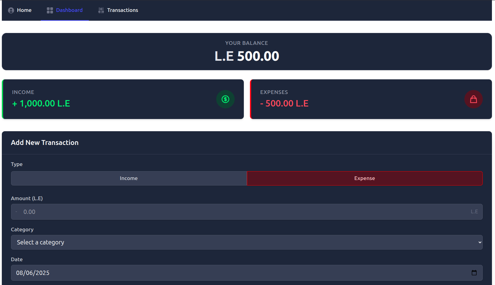

# Expense Tracker

 

A simple and modern expense tracking application built with Vue 3, Vite, and Tailwind CSS. Manage your personal finances with intuitive transaction tracking, balance monitoring, and insightful analytics.

## Features

- 💰 **Transaction Management**: Add, edit, and delete income/expense transactions
- 📊 **Real-time Balance Tracking**: Automatic calculation of current balance
- 📈 **Financial Insights**: Visualize income vs. expenses
- 🏷 **Category System**: Organize transactions by custom categories
- 📱 **Responsive Design**: Works on all device sizes
- 🚀 **Fast Performance**: Built with Vite for optimal speed

## Technologies Used

- Vue 3 (Composition API)
- Vite (Build Tool)
- Vue Router (Navigation)
- Tailwind CSS (Styling)
- Heroicons (Beautiful SVG icons)

## Project Setup

### Prerequisites
- Node.js (v16 or higher recommended)
- npm (v8 or higher)

### Installation
```sh
npm install
```

### Compile and Hot-Reload for Development

```sh
npm run dev
```
